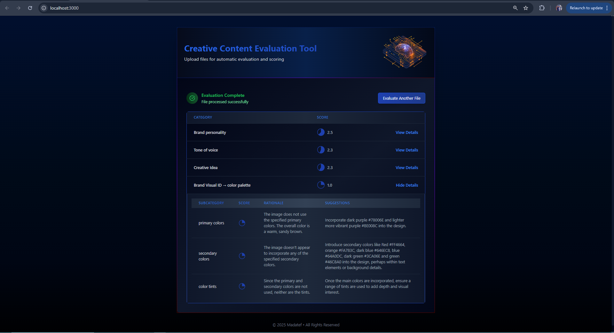

# Creative content evaluation tool

This project enables you to provide a set of guidelines for your content (images in this case, but can be extended for multimodal inputs), upload the file to be evaluated, and get scores, rationale, and suggestions to improve the quality for each element of the guidelines.
**Note:** this is a demo for a larger project that has been provided to a government authority in Saudi Arabia. For this reason, this demo makes API calls to other services (S3 file upload and Gemini) that I built for Dragify during my time at Cloudilic and which I don't have permission to expose publicly. 

---
## A snapshot of the results:

---

## Getting Started

Follow these steps to get the project running locally.

### 1. Clone the Repository
```bash
git clone https://github.com/madatef/Content-evaluator
cd content-evaluator
```

---

### 2. Run the Backend

1. Open a terminal and navigate to the backend directory:
   ```bash
   cd backend
   ```

2. Install the dependencies:
   ```bash
   npm install
   ```

3. Start the backend server:
   ```bash
   node app.js
   ```
   The backend will now be running locally on port 5000, unless otherwise configured.  

---

### 3. Run the Frontend

1. Open **another terminal** from the project root directory (content-evaluator if not renamed) and navigate to the UI directory:
   ```bash
   cd UI
   ```

2. Install the dependencies:
   ```bash
   npm install
   ```

3. Start the development server:
   ```bash
   npm run dev
   ```

   The frontend should now be running (on `http://localhost:3000` unless otherwise configured).

---

## Editing Guidelines

To update the project's evaluation or response guidelines:

1. Open the `guidelines.json` file in the backend directory and make the necessary changes.
2. Edit the `prompt` variable inside `judge.js` to incorporate those new or updated guidelines.

> **Note:** Changes to guidelines or prompts may require a server restart to take effect.


---

## Project Structure

```
project-root/
│
├── backend/                   # Backend server code (Node.js)
│   ├── app.js
│   ├── guidelines.json
│   ├── judge.js
│   ├── package.json
│   └── package-lock.json
│
├── UI/                        # Frontend UI (Vite + React + Tailwind)
│   ├── public/                # Static assets
│   │   ├── ai-bg.png
│   │   └── ai-favicon.png
│   │
│   ├── src/                   # Source code
│   │   ├── components/
│   │   │   ├── EvaluationTable.jsx
│   │   │   ├── FileDropzone.jsx
│   │   │   └── ScoreCircle.jsx
│   │   ├── App.css
│   │   ├── App.jsx
│   │   ├── index.css
│   │   └── main.jsx
│   │
│   ├── eslint.config.js
│   ├── index.html
│   ├── package.json
│   ├── package-lock.json
│   ├── postcss.config.js
│   ├── tailwind.config.js
│   └── vite.config.js
│
├── .gitignore
└── README.md
```

---

## Contributing

1. Fork the repo and create a feature branch:
   ```bash
   git checkout -b feature/your-feature-name
   ```
2. Commit and push your changes:
   ```bash
   git commit -m "Add your message here"
   git push origin feature/your-feature-name
   ```
3. Submit a pull request for review.

